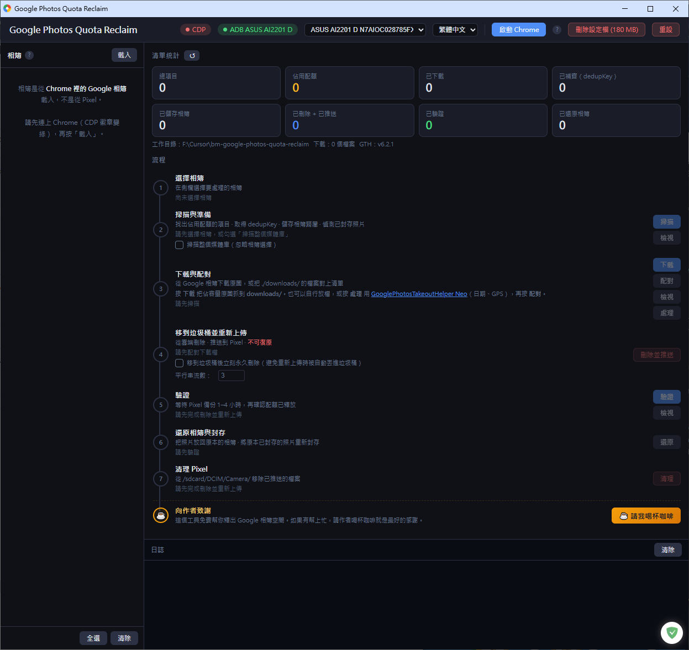

# Google Photos Quota Reclaim

[🇷🇺 Читать на русском](README.ru.md)

Reclaim Google Photos storage quota. Finds quota-consuming photos, downloads them, deletes from the cloud, and re-uploads via a **Pixel 1**'s grandfathered unlimited original-quality backup — so they cost zero quota.

## Features

- **Album preservation** — saves album memberships before deletion and restores them after re-upload
- **Archive preservation** — detects archived photos and re-archives them automatically after re-upload
- **Automatic transfer to Pixel** — pushes files directly to the device over USB using ADB, no manual copying required
- **Incremental & resumable** — every step is idempotent; you can stop and continue at any point without losing progress
- **Parallel processing** — configurable number of concurrent streams for faster trash and re-upload
- **Metadata preservation** — optional integration with [GooglePhotosTakeoutHelper Neo](https://github.com/Xentraxx/GooglePhotosTakeoutHelper_Neo) to restore original dates and GPS from Takeout sidecars before re-uploading
- **Intuitive GUI** — step-by-step interface guides you through the entire process with real-time progress
- **English, Russian, Traditional Chinese, Simplified Chinese, and Japanese interface** — switch languages with one click

## Screenshots

## Requirements

- **Google Chrome** — must be installed (the app launches and controls it automatically)
- **Node.js 18+** — download from [nodejs.org](https://nodejs.org/) (LTS version recommended)
- **Pixel 1** with USB debugging enabled and Google Photos set to Original Quality backup
- Windows 10/11 (macOS and Linux are supported but require a manual ADB setup — see below)

## Get Started

1. **Download** the latest release archive and extract it to any folder 
2. **Launch the app** — run `Google Photos Quota Reclaim.bat`; the app will open in a separate window automatically
3. **Open Chrome** — click **Launch Chrome** in the top bar, then sign into Google Photos in the browser window that opens
4. **Connect your Pixel 1** via USB cable — the ADB indicator in the top bar will turn green when the device is detected
5. **Click Load** in the sidebar, select the albums you want to process, and follow the on-screen steps

## ADB Setup

### Windows

ADB is bundled in the release archive — no extra steps needed.

### macOS / Linux

Download [Android Platform Tools](https://developer.android.com/tools/releases/platform-tools) from the official Android site, extract the archive, and copy the `adb` binary into the `adb/` folder next to the app, replacing the placeholder file.

## How it works

1. **Scan & Prepare** — select albums in the sidebar (or enable *Scan all library*) to find all photos that consume quota; the app also detects which ones are archived and saves album memberships
2. **Match Downloads** — the app downloads originals to the `downloads/` folder; click Match to link the files to the manifest
3. **Trash + Reupload** — deletes photos from Google Photos cloud and pushes them to the Pixel via USB *(irreversible step)*
4. **Wait 1–4 h** — Google Photos on the Pixel backs up the files to the cloud at Original Quality, free of charge
5. **Verify** — confirms that quota was freed for each photo; use the View button to see which ones are still pending
6. **Restore Albums & Archives** — puts photos back into their original albums and re-archives photos that were archived before
7. **Cleanup Pixel** — removes the pushed files from the device's camera roll

## Implementation details

See [docs/implementation.md](docs/implementation.md) for the CLI pipeline, RPC reference, critical constraints, and technical notes.

## License

MIT

---

## Support

If this tool saved you time or storage space, consider buying the author a coffee.

